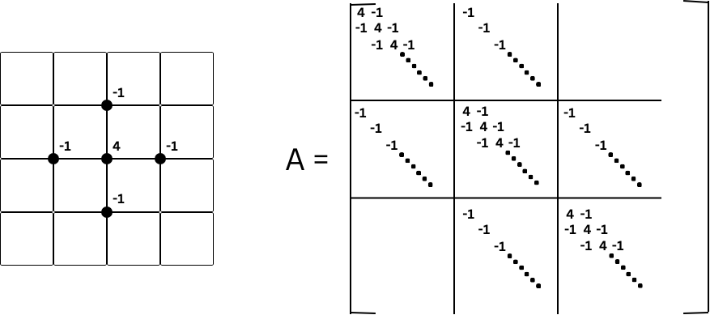

# Multigrid Methods for Two-dimensional and Three-dimensional Poisson Equation

## Introduction
Numerical methods play a crucial role in solving complex problems in scientific and engineering fields, with multigrid algorithms being particularly effective for solving partial differential equations (PDEs). This project focuses on implementing and analyzing various multigrid algorithm variants, primarily in the context of two-dimensional and three-dimensional Poisson problems.

## Multigrid on Two-dimensional Poisson Equation
The project explores a hierarchy of grids with different grid spacings and compares the V-cycle and Full-cycle implementations. The study includes the Jacobi method as the smoothing operator. The performance comparison highlights that the Full-cycle method provides efficient results across different grid hierarchies with error magnitudes comparable to the V-cycle. Computational costs and true error analyses support this conclusion.

 
 
Figure 1: two-dimensional Poisson Equation where A indicates the sparse matrix.

### Smoothing, Prolongation, and Restriction
The report explains the smoothing, prolongation, and restriction operations used in multigrid methods to facilitate the iterative solution of linear systems, particularly in solving PDEs.

 
Figure 2: two-dimensional Poisson Equation prolongation matrix that maps approximate solution from coarse grid to fine grid, where black grid lines indicate coarse grids, and blue grid lines indicate fine grids.

 
Figure 3: two-dimensional Poisson Equation restriction matrix that maps approximate solution from fine grid to coarse grid, where black grid lines indicate coarse grids, and blue grid lines indicate fine grids.

### V-cycle and Full-cycle
The V-cycle and Full-cycle multigrid methods are detailed, with the V-cycle efficiently addressing errors at different scales and the Full-cycle providing a comprehensive iterative refinement. Performance comparisons show trade-offs between computational efficiency and solution accuracy.

 
 
Figure 4: V-cycle procedures across the grid hierarchy in multigrid.

 

Figure 5: Full-cycle procedures across the grid hierarchy in multigrid.

### Results
|             | 4        | 5        | 6        | 7        | 8        |
|-------------|----------|----------|----------|----------|----------|
| V-cycle	  | 0.049361 | 0.052257 | 0.060833 | 0.144464 | 0.189070 |
| Full-cycle  | 0.008783 | 0.011279 | 0.013074 | 0.015321 | 0.022207 |

Table 1: two-dimensional Poisson Equation computational cost in seconds between V-cycle and Full- cycle, where the numbers in the header indicates n, which is the level the grid. All simulations are done on a computer with a 2018 Quad-Core Intel Core i5.

|             | 4        | 5        | 6        | 7        | 8        |
|-------------|----------|----------|----------|----------|----------|
| V-cycle	  | 0.001048 | 0.000272 | 6.92e-05 | 1.74e-05 | 4.38e-06 |
| Full-cycle  | 0.000956 | 0.000255 | 6.66e-05 | 1.70e-05 | 4.33e-06 |

Table 2: two-dimensional Poisson Equation true error between V-cycle and Full-cycle, where the numbers in the header indicates n, which is the level the grid. All simulations are done on a computer with a 2018 Quad-Core Intel Core i5.

 
Figure 6: two-dimensional Poisson Equation solved by V-cycle where x-axis represents iteration, and y-axis represents the true error.

## Multigrid on Three-dimensional Poisson Equation
Similar to the two-dimensional case, the project extends the analysis to three-dimensional Poisson problems. The V-cycle and Full-cycle methods are applied, and the results demonstrate promising efficiency and accuracy in the solution. Computational costs and true error analyses support the findings.

 
Figure 7: three-dimensional Poisson Equation where A indicates the sparse matrix.

### Prolongation and Restriction in Three Dimensions
The report details the trilinear prolongation and restriction operators used in three-dimensional multigrid methods.

 

Figure 8: three-dimensional Poisson Equation prolongation matrix. The arrows denote the coarse grid points to be used for prolonging the dense grid point. The numbers attached to the arrows denote the contribution of the specific coarse grid point.
 

 
Figure 9: three-dimensional Poisson Equation restriction matrix. A 27-point full weighting scheme is used. The number in front of each grid point denotes its weight in this operation.

### Results
|             | 4        | 5        | 6        | 7        | 8        |9|
|-------------|----------|----------|----------|----------|----------|----------|
| V-cycle	  | 0.034554| 0.0474298| 0.093284| 0.417230| 4.653774| 50.41819|
| Full-cycle  | 0.028102 | 0.009566 | 0.024155 | 0.066664 | 0.451829 |5.138207 |

Table 3: three-dimensional Poisson Equation computational cost between V-cycle and Full-cycle, where the numbers in the header indicates n, which is the level the grid. All simulations are done on a computer with a 2018 Quad-Core Intel Core i5.

|             | 4        | 5        | 6        | 7        | 8        |9|
|-------------|----------|----------|----------|----------|----------|----------|
| V-cycle	  | 0.041817 |0.012218| 0.003172| 0.000800| 0.000200| 5.018630|
| Full-cycle  | 0.004089 |0.015102 |0.007517 |0.002526 |0.000731 |0.000197 |

Table 4: three-dimensional Poisson Equation true error between V-cycle and Full-cycle, where the num- bers in the header indicates n, which is the level the grid. All simulations are done on a computer with a 2018 Quad-Core Intel Core i5.

 

Figure 10: three-dimensional Poisson Equation solved by V-cycle where x-axis represents iteration, and y-axis represents the true error.

## Preconditioner for Krylov Subspace Solvers
The project explores the implementation of a multigrid preconditioner for Krylov subspace solvers, such as CG and GMRES, for two-dimensional problems. The preconditioner's effectiveness is demonstrated through iterations and error analyses.

 

Figure 11: two-dimensional Poisson Equation with multigrid precondtioner for CG and GMRES methods, where N is the level the grid.

## References
1. Andrew V Knyazev, Klaus Neymeyr. Efficient solution of symmetric eigenvalue prob- lems using multigrid preconditioners in the locally optimal block conjugate gradient method. Electronic Transactions on Numerical Analysis, 15, 38–55, 2003.

2. Bramble, James H., Joseph E. Pasciak, and Jinchao Xu. "Parallel multilevel precon- ditioners." Mathematics of Computation 55, no. 191 (1990): 1–22.

3. Can K. Sandalci, «. K. CoÁ, S. M. Goodnick: Three Dimensional Monte Carlo Device Simulation with Parallel Multigrid Solver. PPSC 1997

4. D.J. Mavriplis. Directional coarsening and smoothing for anisotropic Navier-Stokes problems. Elect. Trans. Num. Anal., 6:182–197, 1997.

5. Jun Zhang. Fast and high accuracy multigrid solution of the three-dimensional Poisson equation. J. Comput. Phys., 143:449–461, 199.

6. Saad, Yousef & van der Vorst, Henk (2001). "Iterative solution of linear systems in the 20th century". In Brezinski, C. & Wuytack, L. (eds.). Numerical Analysis: Historical Developments in the 20th Century. Elsevier Science Publishers. §8 Preconditioning methods, pp 193–8. ISBN 0-444-50617-9.